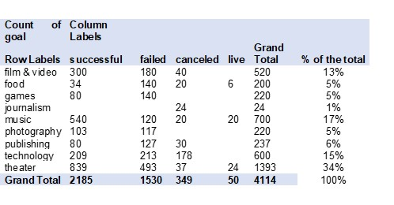

# Analysis crowdfunding service: Kickstarter
Over $2 billion has been raised using the massively successful crowdfunding service, Kickstarter, but not every project has found success. Of the more than 300,000 projects launched on Kickstarter, only a third have made it through the funding process with a positive outcome.

Getting funded on Kickstarter requires meeting or exceeding the project's initial goal, so many organizations spend months looking through past projects in an attempt to discover some trick for finding success.

In this project, I analyzed a database of 4,000 past projects in order to uncover any hidden trends.

## Analysis:

### Table 1: Status of the campaigns per categories

### Graph 1: Status of the campaigns per sub-categories

According to the Table1: Status of the campaigns per categories, "Theater" is the category that has the highest number of campaigns, with 34% of the total 4114 campaigns. According to the Graph 1: Status of the campaigns per sub-categories, it can be seen where the subcategory of "plays" has the largest number of successful, failures and live status of all considered. On the other hand, the campaigns "food / food trucks" and "technology / wearables", are the campaigns with the highest cancellation rate.

### Table 2: Outcomes based on goals

Considering the Table 2: Outcomes based on goals, the campaigns that ask for donations between $ 1 - $ 9,999, are more inclined to meet the goal of the money to be collected, considering that the percentage of campaigns cancellation under that monetary range is low (less than or equal to 7%). Likewise, those campaigns that request between $ 35,000 - $ 44,999, have a probability of meeting the goal close to 50% with a cancellation percentage less than 15% (this being a promising detection).

### Graph 2: Status of the categories discriminated by month (consolidated: 2009 – 2017):
 

According to the database received for analysis, in recent years, there tend to be more campaigns than in previous years. This could be explained by the recent creation of the web page "Kickstarter", which was created on April 28, 2009 . However, in the Graph 2: Status of the categories discriminated by month (consolidated: 2009 – 2017), where the months of operation are consolidated, successful campaigns are launched in February, April, May, June and July, while in the months of January, June, July and October, major campaigns cancellations are evident.

## Other important graphs:
### •	Graph: Line with markers.
In order to see the trend of the status of the categories over the years since the creation of the crowdfunding platform (2009).

Graph: Status of the categories discriminated by year (consolidated: 2009 – 2017):

### •	Chart: Cluster column. 
To compare the status of campaigns by sub-categories (consolidated: 2009 - 2017):

Graph: Status of the campaigns per categories

 
### •	Chart: Pie. 
To visualize the distribution or proportion of each category over a total value; in this case, the status. (In the graph you can see the status: successful, but I can create the same type of graph for others status -failed, canceled and live-).

Graph: distribution of categories by status (successful)
 
 
 
 
### •	Chart: Shaded area to a line chart.  
To highlight the line chart.

Chart: Status of the categories discriminated by month (consolidated: 2009 - 2017):

 
 

### •	Chart: Funnel. 
For the information analyzed on the "Bonus". This graph would be used to represent the ranges of donations and thus show the amount of potential money requested in the campaigns to complete with successful status.

Graph: Outcomes based on goal

 

 
### •	Chart: Pareto. 
For the information analyzed on the "Bonus". Show the distribution of the goal (amount of money) in descending order of frequency, with a cumulative line on a secondary axis as a percentage of the total.

Graph: Outcomes based on goal

 

 
 
## Limitations of this dataset?

It is relevant to mention that the sample taken is limited compared to the total campaigns launched in Kickstarter. In the introduction of the case, it says there are more than 300,000 projects, where one third of these are successful. However, in the results of the sample, a total of 53% campaigns were successful, that is, the sample taken is not a representative sample of the campaigns launched on the crowdfunding platform.
